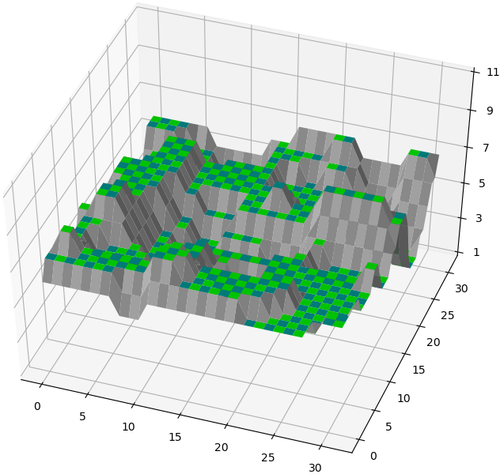

# sentland.py

A Python script to generate landscapes matching those in Geoff Crammond's
classic 80's game: The Sentinel (aka The Sentry).

The script generates the landscape and positions of all game objects.

## Requirements

The script requires Python 3.6 or later with the _NumPy_ package installed. You
can install NumPy using:

```
python -m pip install numpy
```

Viewing landscapes with `-v` also requires the _matplotlib_ package, which can
be installed using:

```
python -m pip install matplotlib
```

## Usage

Generate landscape 1234 and save to `1234.bin` (data in row order):
```
python sentland.py 1234
```

Generate landscape 9999 and save to `9999.bin` (data in game memory format):
```
python sentland.py 9999 -m
```

Generate and view landscape 0000:
```
python sentland.py 0 -v
```

Here's a sample view of landscape 0000, shown using matplot:



## Landscape Data

The game stores the landscape as an 32x32 array of vertices, each represented
by a single byte. This gives the 31x31 arrangement of tiles that make up the
landscape.

Each byte holds two nibbles of data. The upper 4 bits hold the vertex height,
and the lower 4 bits a code indicating the shape of the tile. The shape helps
the game quicly know whether a tile is flat, as well as how to draw it, without
needing to look at the neighbouring vertices each time.

If the height value is 12 or above it means there is an object placed on a
flat tile. In that case the low 6 bits is an index into various object tables.
It may be necessary to walk a chain of stacked objects to locate the original
tile height. The map data generated by this script doesn't contain any objects
so these values will not be seen here.

The in-memory layout of the map is not a plain 2D array of values. To match the
original memory layout use the `-m` option when saving data.

## Landscape Generation

All landscapes are generated using the following steps:

### 1) Seed the RNG

The RNG is seeded using the landscape number, as described in the
[sentcode.py](https://github.com/simonowen/sentcode) project.

### 2) Warm the RNG

To ensure good random numbers are provided, 81 values are read from the RNG into
a buffer. Note: these values are not used during the remainder of the process.

### 3) Height scale

Height scaling determines the range between the lowest and highest points on
the landscape. Lower values keep the landscape flatter and easier to navigate.
Landscape 0000 uses a fixed scaling factor of 0x18, but all other landscapes
use a random value massaged into the range 0x0e to 0x24. This will be used in
step 6 below.

### 4) Random fill

The map area is filled with byte values from the RNG, with rows from back to
front, in right to left order. The reverse ordering is due to the original 6502
game code, which loops backwards as long as the index is positive using the
`BPL` instruction.

### 5) Smoothing passes

The random values are smoothed by averaging groups of 4 values and replacing the
first value with this average. This is performed on each row from back to front,
then each column from right to left. This process is repeated a second time.

### 6) Scale and offset

The smoothed values are treated as signed 7-bit values by subtracting each from
0x80. The result is scaled by multiplying it by the height factor from step 3
above, then taking the upper 8 bits of the result to give the height. This is
then offset by 6 to re-centre in the middle of the height range, before being
clamped into the legal range of 1 to 11.

### 7) De-spike passes

To improve the appearance of the map all single vertex spikes and troughs are
removed. This is again performed on rows from back to front, and columns from
right to left. This process is repeated a second time.

De-spiking takes spans of 3 vertices and decides on a new central vertex height.
This was originally thought to be flattening the centre if the sides were both
above or below it but the logic is slightly more complicated. See the code for
details.

This completes the final height generation, but not the stored data.

### 8) Shape codes

To simplify use of the map at runtime the groups of 4 vertices that form each
tile are compared to determine whether it's level and how it will appear when
drawn. This forms a 4-bit code, which is stored (for now) in the upper 4 bits of
each map value.

A code of zero means the tile is level (all vertex heights match). See the
script code for the layouts that generate the other values. Value 8 not used.

### 9) Nibble swap

The game prefers to work with the height in the upper 4 bits and the shape in
the lower 4 bits, so this step reverses the order of the nibbles. This makes it
easier to check map locations for placed objects without any masking, indicated
by a map value of 0xc0 or greater.

## Object Placement

After generating the landscape objects are placed on it, in the order: pedestal,
Sentinel, sentries (if any), player (robot) and trees. The number of sentries
and trees varies between landscapes and the landscape colour depends this count.

### 1) Sentry count

The base count of sentries is taken from the thousands digit of the landscape
number, plus two. Then a value is taken from the RNG to use as an adjustment
from this count. The number of leading zeros in the binary representation of the
lower 7 bits forms a value, which is negative (1s complement) if bit 7 was set.
If the sum is in range 0-7 this count is used, otherwise the process is
repeated until it's in range.

The bias of 2 in the calculation is what prevents the extended hex landscapes
(E000 and above) being usable in
[Augmentinel](https://simonowen.com/spectrum/augmentinel/). The final sentry
count is never in range and the loop continues forever.

For levels below 100 the sentry count is also limited to the tens digit of the
landscape number, to make earlier levels a little easier.

### 2) Highest points

The map is scanned for the highest points to place the Sentinel and sentries.
This is done in 4x4 areas (less 1 for right and back edges), in order from front
to back and left to right. Within each area the height and location of the
highest flat tile is stored. This gives up to 64 potential placement locations.

### 3) Random high point

The highest level from the previous step is used as a starting point to place
the Sentinel and possibly sentries. The results from the previous step are
filtered for this height to give a subset of potential positions to use. If no
positions are found the height is reduced by 1. If it hits zero no more
placements are made. The position list is generated in reverse order due to the
C64 reversed loop indexing in the code.

A value is taken from the RNG to use as an index into the new list. To avoid
discarding too many out-of-range random indices the nearest 2^n-1 bitmask above
the count is applied first. If it's still out of range the process is repeated.

### 4) Place Sentinel/sentries

Once a valid random position is found the next Sentinel or sentry is ready for
placement. If we're placing the Sentinel we put a pedestal on the same location
first, with the Sentinel on top of it.

All placed objects have a random rotation assigned. A value is taken from the
RNG and masked with 0xf8 to align it with one of 32 rotation steps. Then 0x60
(135 degrees) is added to it before use. I believe this bias was tuned to give
the best starting view for the player. Even though the pedestal is given a
rotation it's reset to zero to align it with the tile it sits on. Zero degrees
is facing away and angles represent clockwise rotation.

After placement the current 4x4 tile region and all 4x4 tiles surrounding it are
marked with zero height to ensure a sentry is not placed too close to this one.
This also gives a good spread of objects across the landscape.

A value is taken from the RNG to determine the delay before first rotation and
the rotation direction. If bit 0 is set the entity rotates anti-clockwise. Bits
5 to 0 from the value are ORed with 5 give the number of game timer ticks until
the object is due to rotate next.

If more sentries are due to be placed the process repeats from step 2) above.

### 5) Place player

Landscape 0000 has a fixed starting location for the player at x=8 z=17. This
was probably chosen to give the player a position with good visibility and
moving options.

All later landscapes place the player at a random position on the map. This
location also has a maximum height to avoid the player being placed at or above
the height of the lowest sentry. The height is further limited to 6 or below.

x and z coordinates are taken from the RNG and masked against 0x1f, each
repeating until they're below 0x1f. This location is checked for an unoccupied
flat tile below the height limit. This repeats up to 255 times until a suitable
location is found. If the search is unsuccessful the height cap is raised by one
and the process repeated. This continues until the maximum map height of 0xc.

### 6) Place trees

The number of trees is used to balance out the total energy available on the
landscape. More sentries means fewer trees can be placed.

The calculated number of trees is random with a bias. Take a value from the RND
and sum the values from bits 0-2, bits 3-6 (shifted down), then add 10. The
maximum number of trees is 48, minus 3 for each placed sentry/Sentinel. If the
count is above this maximum it's capped.

Trees are placed at random positions on the map using the same logic as placing
the player, and with the most recent height cap value.

### Secret Code

Once all objects are placed the RNG is used to generate the secret code for the
current landscape, using the platform-specific technique described in the
[sentcode](https://github.com/simonowen/sentcode) project.

## Test Data

The '_golden_' sub-directory contains data exported after each generation step
listed above. It was exported from address `0x6100` in the Spectrum version of
the game. Data for landscapes 0000 and 9999 is provided, and compared against
generated data for these levels.

---

Simon Owen  
https://simonowen.com
